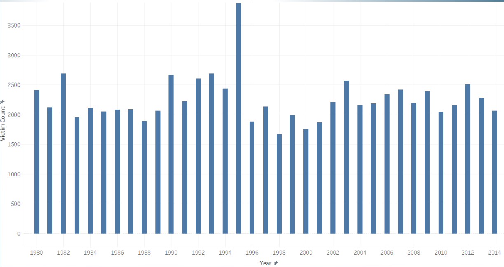
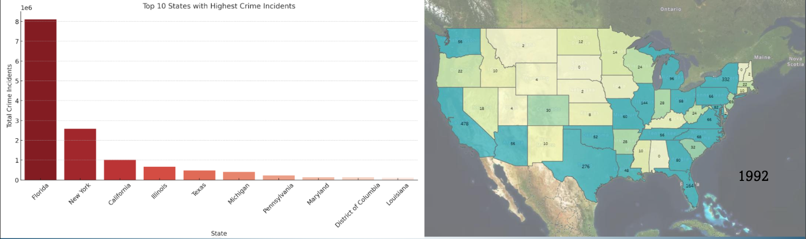
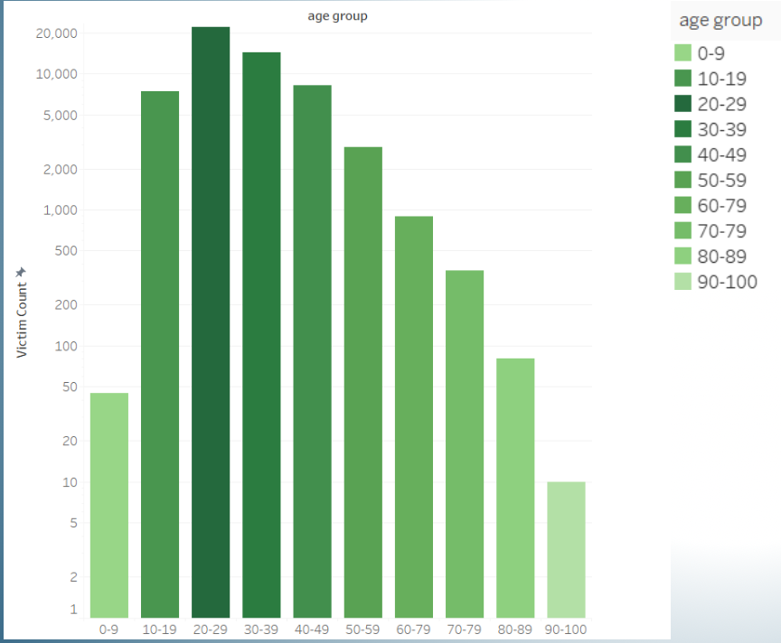
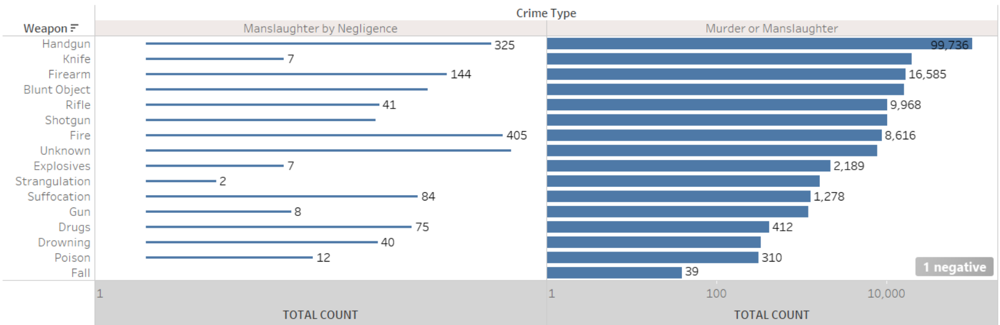
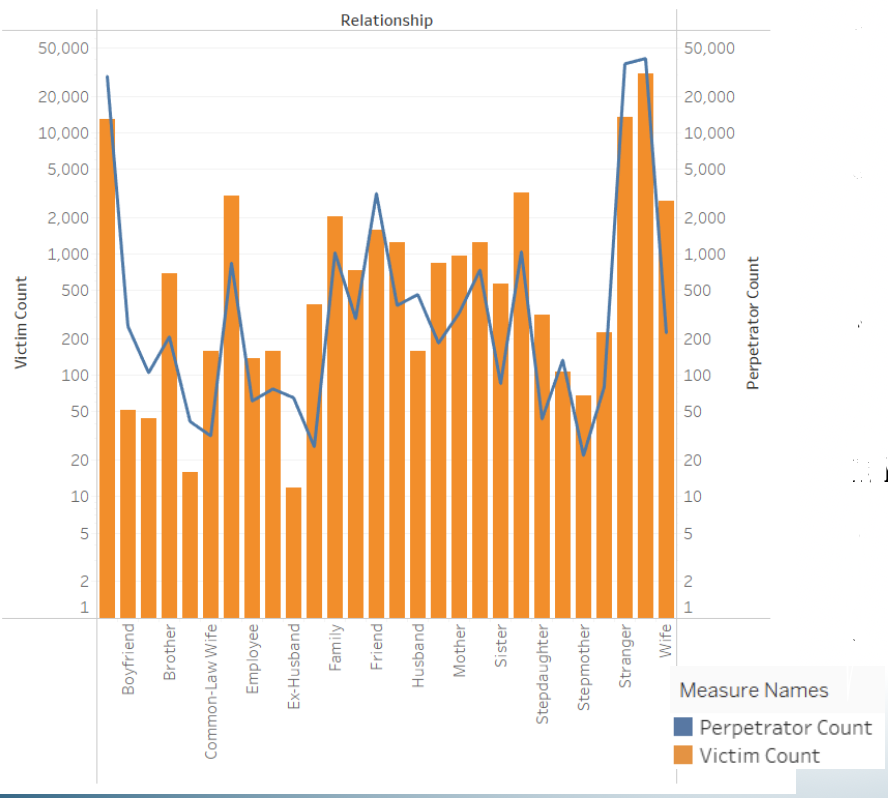

# 🚔 U.S. Crime Data Analysis
Built as part of MS in Data Analytics Engineering – Northeastern University

## 📌 Overview
This project analyzes crime data across the United States to identify patterns, trends, and insights that can support crime prevention and policy-making decisions.

The analysis focuses on understanding how crime varies across states, time, and demographic factors using data visualization and Tableau dashboards.

---

## 🎯 Objective
- Identify the most common crime types  
- Analyze crime trends over time (1980–2014)  
- Understand geographic distribution of crimes  
- Explore victim and perpetrator patterns  
- Analyze crime-solving trends  

---

## 📊 Dataset

⚠️ The dataset is too large to be stored directly in this repository.Due to large file size, the dataset cannot be hosted directly on GitHub.

👉 Access full dataset here:  
[Download Dataset (Google Drive)](https://drive.google.com/file/d/1_qvsSHzP5Fy0T6BPcnatB19QJvNxi04K/view?usp=sharing)

Note: The dataset is large and may not preview in the browser. Please download the file to use it.

Dataset Details:
- Source: Kaggle (FBI Crime Data)
- Records: 638,454
- Time Period: 1980 – 2014

---

## 🛠️ Tools & Technologies
- Tableau (Dashboard & Visualization)
- Python (Data Cleaning)
- Excel / CSV

---

## ⚙️ Data Processing
- Cleaned and structured dataset  
- Converted categorical variables using encoding  
- Fixed inconsistent data types  
- Prepared data for visualization  

---

## 📈 Key Insights
- Crime rates fluctuate across years  
- Some states consistently show higher crime rates  
- Highest victim group: 20–29 years  
- Handguns are the most commonly used weapon  
- Majority of crimes occur within the same racial group  
- Seasonal trends observed (higher in summer months)  

---

## 📊 Visualizations
This project includes:
- Bar Charts → Crime trends over time  
- Heatmaps → Crime distribution across states  
- Line Charts → Yearly analysis  
- Age Distribution Charts  
- Weapon Analysis  

---

## 📸 Sample Visualizations

### 📊 Overall Crime Trends

### 🗺️ Crime Distribution Across States

### 👥 Victim Age Distribution

### 🔫 Weapon Usage Analysis

### 🤝 Victim-Perpetrator Relationship

---

## 📊 Tableau Dashboard
Interactive dashboard created using Tableau:
- Filters: State, Year, Crime Type  
- Dynamic visual exploration  

---

## 🚀 How to Use
1. Download repository  
2. Open `.twbx` file in Tableau  
3. Explore dashboards interactively  

---

## 📂 Project Structure
- `data/` → dataset info  
- `dashboards/` → Tableau files  
- `reports/` → project report  
- `presentation/` → PPT  
- `images/` → visual outputs  

---

## 👨‍💻 Authors
- Dev Patel
- Hitaxi Lethwala   
